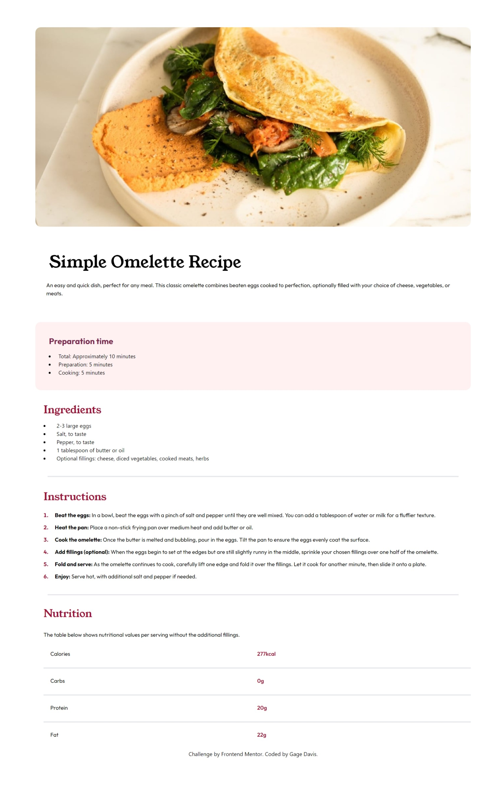

# Frontend Mentor - Recipe page solution

This is a solution to the [Recipe page challenge on Frontend Mentor](https://www.frontendmentor.io/challenges/recipe-page-KiTsR8QQKm). Frontend Mentor challenges help you improve your coding skills by building realistic projects. 

### Screenshot

### Links

- Solution URL: Working on this at the moment.
- Live Site URL: Working on this at the moment.
## My process

### Built with

- HTML, CSS, TAILWINDCSS :)

### What I learned

I learned how to set up a basic static page using tailwind css, How fast you can apply and add responsiveness to a project with tailwind. 
Always starting with mobile first, because I did not lol. It would've made this project much easier.

### Continued development

While building this project I found that for future projects the reuse of styles with tailwind could come in handy for "Dryer Code".

### Useful resources

Having this open in your browser when working the tailwind to reference styles is very handy because im not super human, I cant remember everything lol.

https://tailwindcss.com/docs/installation

## Author

Working on gathering all these. 

- Website - [Add your name here](https://www.your-site.com)
- Frontend Mentor - [@yourusername](https://www.frontendmentor.io/profile/yourusername)
- Twitter - [@yourusername](https://www.twitter.com/yourusername)

**Note: Delete this note and add/remove/edit lines above based on what links you'd like to share.**

## Acknowledgments

Just a solo mission on this one : ). 
